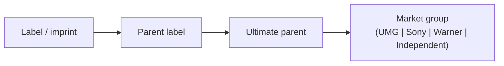
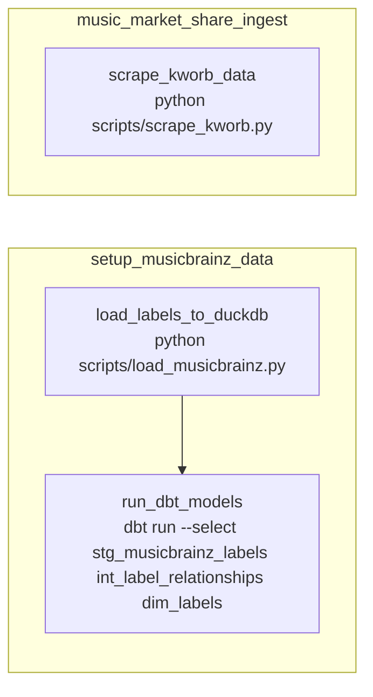
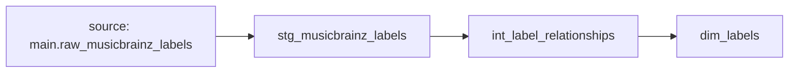
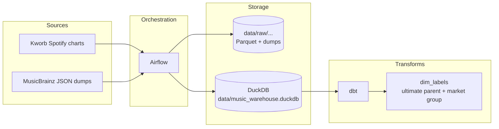

# music-market-share-warehouse

This repository is a small, reproducible data warehouse project that focuses on building and orchestrating an end-to-end pipeline around music industry “ownership” metadata. The goal is to make it possible to attribute streaming activity to ultimate parent labels that are investable securities (e.g., UMG/Sony/Warner vs. independent) using public, alternative datasets. Illustrative path produced by `dim_labels.ownership_path`:



The project is intentionally local first: it runs in Docker, orchestrates jobs with Airflow, stores data in DuckDB, and models transformations with dbt. The emphasis is on the workflow and data modeling mechanics (ingestion, idempotency, transforms, and lineage).

## Architecture

Airflow runs two pipelines: a daily chart ingestion that lands raw data to a local “data lake” directory, and a metadata setup pipeline that loads MusicBrainz label data into DuckDB and runs dbt models to build a label ownership dimension. DuckDB is used as the warehouse and dbt is used to define the transformation layers (staging → intermediate → mart).

## Data sources

Chart data is scraped from Kworb’s Spotify chart pages. Label reference data comes from the MusicBrainz JSON dumps, which include label-to-label relationships needed to build an ownership hierarchy.

Spotify credentials are only needed for optional enrichment scripts, the core ingestion + dbt label models do not require them.

## What runs in Airflow

The Airflow DAGs live in [dags](dags).

`music_market_share_ingest` runs daily and executes a Python scraper that writes Parquet files under `data/raw/kworb/`.

`setup_musicbrainz_data` is intended to be triggered manually. It loads the MusicBrainz label dump into DuckDB as `main.raw_musicbrainz_labels`, then runs dbt to build the transformed label models.



## Warehouse and dbt models

The DuckDB database file is `data/music_warehouse.duckdb` (mounted into the Airflow containers as `/opt/airflow/data/music_warehouse.duckdb`). The dbt project is in [dbt_project](dbt_project) and targets DuckDB via [dbt_project/profiles.yml](dbt_project/profiles.yml).

The label modeling layer is split into:

Staging: `stg_musicbrainz_labels` (light renames and passthrough)

Intermediate: `int_label_relationships` (unnests `relations` from the raw JSON into one row per relationship)

Mart: `dim_labels` (recursive traversal to map each label to an “ultimate parent” and assign it to a coarse market group)

#### dbt lineage (label ownership models)



## Quickstart (local)

Prerequisites are Docker + Docker Compose.

Copy the example environment and enter Spotify credentials if you want to do the optional extra enrichment.

Build and start Airflow:

```bash
docker compose up --build
```

Open the Airflow UI at `http://localhost:8080` (default credentials are `admin` / `admin` as configured in docker-compose).

Trigger the setup pipeline once:

1) In the UI, unpause `setup_musicbrainz_data`.

2) Trigger it manually.

This loads `raw_musicbrainz_labels` and then runs dbt (`stg_musicbrainz_labels`, `int_label_relationships`, `dim_labels`).

The daily ingestion pipeline can be unpaused afterwards:

1) Unpause `music_market_share_ingest`.

2) Let it run on schedule (or trigger manually).

## Inspecting outputs

You can query the DuckDB warehouse directly. For example (from your host machine):

```bash
duckdb data/music_warehouse.duckdb
```

Then:

```sql
select count(*) from dim_labels;
select market_share_group, count(*) from dim_labels group by 1 order by 2 desc;
```

Raw chart extracts land under `data/raw/kworb/` as Parquet files named like `kworb_spotify_global_daily_YYYY-MM-DD.parquet`.

## Diagrams

### End-to-end flow



## Future Enhancements

This repo currently focuses on orchestrating ingestion and building the label ownership dimension. The chart ingestion writes Parquet to the local data directory; loading chart rows into DuckDB and joining chart stream volumes to `dim_labels` is the natural next step if you want a fully automated “market share over time” mart.
